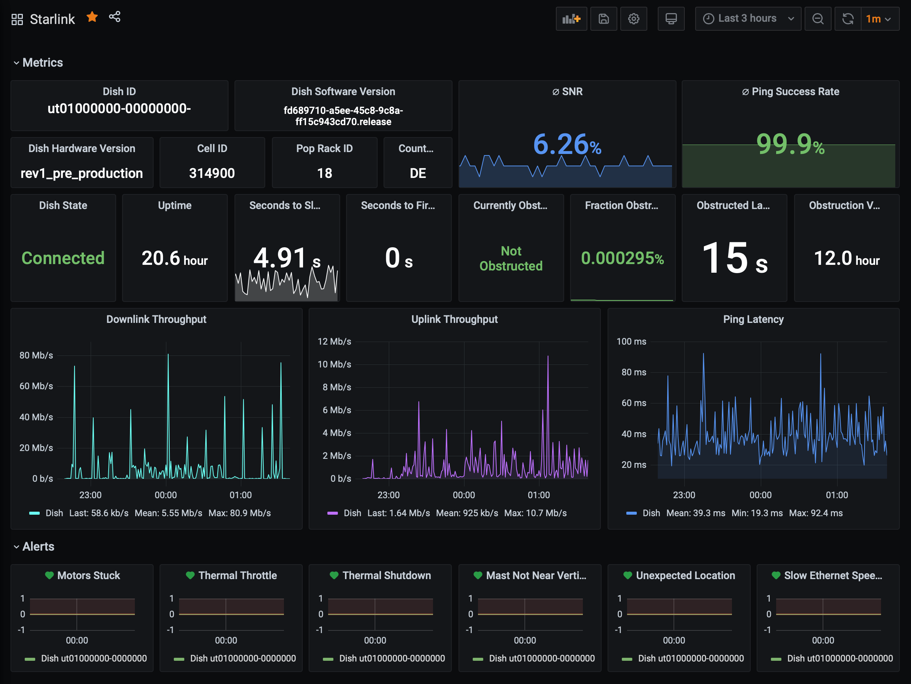

# starlink-exporter

[](https://github.com/ewilken/starlink-exporter/actions?query=workflow%3ACI)
[](https://github.com/ewilken/starlink-exporter)

Prometheus exporter for the metrics exposed by the gRPC endpoint of the SpaceX Starlink user terminal.

Based on [`starlink-rs`](https://github.com/ewilken/starlink-rs).

## Labels

- `id`: ID of the dish. Evaluated on program start and set to every metric.
- `hardware_version`: Hardware version of the dish. Evaluated on program start and set to every metric.
- `software_version`: Software version of the dish firmware. Subject to change at runtime. Re-evaluated on every scrape and set only to the `starlink_dish_device_info` metric.
- `country_code`: Country code of the dish. Subject to change at runtime (sometimes nulled). Re-evaluated on every scrape and set only to the `starlink_dish_device_info` metric.

## Metrics

Currently, the following metrics are exposed:

| Name                                                      | Type     |  Description                                                                                                                |
| --------------------------------------------------------- | -------- | --------------------------------------------------------------------------------------------------------------------------- |
| `starlink_dish_device_info`                               | GaugeVec | Device information. Exposing `software_version` and `country_code` as additional labels.                                    |
| `starlink_dish_uptime_s`                                  | Counter  | Dish uptime in seconds.                                                                                                     |
| `starlink_dish_state`                                     | Gauge    | Dish state. 0: Unknown, 1: Connected, 2: Searching, 3: Booting.                                                             |
| `starlink_dish_alert_motors_stuck`                        | Gauge    | Alert: Motors stuck.                                                                                                        |
| `starlink_dish_alert_thermal_throttle`                    | Gauge    | Alert: Thermal throttle.                                                                                                    |
| `starlink_dish_alert_thermal_shutdown`                    | Gauge    | Alert: Thermal shutdown.                                                                                                    |
| `starlink_dish_alert_mast_not_near_vertical`              | Gauge    | Alert: Mast not near vertical.                                                                                              |
| `starlink_dish_alert_unexpected_location`                 | Gauge    | Alert: Unexpected location.                                                                                                 |
| `starlink_dish_alert_slow_ethernet_speeds`                | Gauge    | Alert: Slow ethernet speeds.                                                                                                |
| `starlink_dish_snr`                                       | Gauge    | Signal-to-noise ratio.                                                                                                      |
| `starlink_dish_seconds_to_first_nonempty_slot`            | Gauge    | Seconds to first non-empty slot.                                                                                            |
| `starlink_dish_pop_ping_drop_rate`                        | Gauge    | Pop ping drop rate.                                                                                                         |
| `starlink_dish_downlink_throughput_bps`                   | Gauge    | Downlink throughput in Bps.                                                                                                 |
| `starlink_dish_uplink_throughput_bps`                     | Gauge    | Uplink throughput in Bps.                                                                                                   |
| `starlink_dish_pop_ping_latency_ms`                       | Gauge    | Pop ping latency in ms.                                                                                                     |
| `starlink_dish_obstruction_currently_obstructed`          | Gauge    | Obstruction: Currently obstructed.                                                                                          |
| `starlink_dish_obstruction_fraction_obstructed`           | Gauge    | Obstruction: Obstructed fraction. Sum of obstructed fractions.                                                              |
| `starlink_dish_obstruction_last_24h_obstructed_s`         | Counter  | Obstruction: Obstructed seconds in the last 24 hours.                                                                       |
| `starlink_dish_obstruction_valid_s`                       | Counter  | Obstruction: Valid seconds.                                                                                                 |
| `starlink_dish_obstruction_wedge_fraction_obstructed`     | GaugeVec | Obstruction: Wedge fraction obstructed. Measure of obstruction in twelve 30 degree wedges around the dish.                  |
| `starlink_dish_obstruction_wedge_abs_fraction_obstructed` | GaugeVec | Obstruction: Wedge fraction obstruction average. Measure of average obstruction in twelve 30 degree wedges around the dish. |

## Usage

Configuration happens via the following env vars:

- `BIND_ADDRESS`: Host and port to bind the HTTP server to. Defaults to `0.0.0.0:9184`.
- `STARLINK_ADDRESS`: Protocol, host and port of the Starlink dish. Defaults to `http://dishy.starlink.com:9200`.

### Local

    cargo run --release

### Docker

    docker build -t ghcr.io/ewilken/starlink-exporter .
    docker run ghcr.io/ewilken/starlink-exporter

### Kubernetes

```yaml
apiVersion: apps/v1
kind: Deployment
metadata:
  name: starlink-exporter
  labels:
    k8s-app: starlink-exporter
spec:
  replicas: 1
  selector:
    matchLabels:
      k8s-app: starlink-exporter
  strategy:
    type: Recreate
  template:
    metadata:
      name: starlink-exporter
      labels:
        k8s-app: starlink-exporter
      annotations:
        prometheus.io/port: '9184'
        prometheus.io/scrape: 'true'
    spec:
      containers:
        - image: ghcr.io/ewilken/starlink-exporter:latest
          name: starlink-exporter
          ports:
            - containerPort: 9184
              protocol: TCP
          resources:
            requests:
              cpu: '0.001'
              memory: '10Mi'
            limits:
              cpu: '0.01'
              memory: '50Mi'
          env:
            - name: RUST_LOG
              value: starlink_exporter=info
            - name: BIND_ADDRESS
              value: '0.0.0.0:9184'
            - name: STARLINK_ADDRESS
              value: 'http://dishy.starlink.com:9200'
      dnsPolicy: ClusterFirstWithHostNet
```

## Grafana

An example Grafana dashboard is included in the [dashboard](dashboard) directory.



## CI & Versioning

[Images hosted on GHCR](https://github.com/users/ewilken/packages/container/package/starlink-exporter) are built in CI from main tagged `latest` and with the short commit hash returned by `$(git log -1 --format=%h)`, e.g. `1354d30`.

## License

`starlink-exporter` is licensed under either of

- Apache License, Version 2.0, ([LICENSE-APACHE](LICENSE-APACHE) or http://www.apache.org/licenses/LICENSE-2.0)
- MIT license ([LICENSE-MIT](LICENSE-MIT) or http://opensource.org/licenses/MIT)

at your option.
